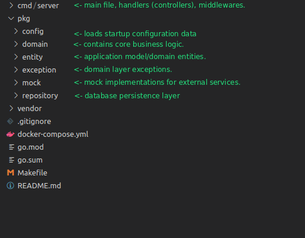

# go-web-starter

> Golang web application starter

## Table of Contents

- [Description](#description)
- [How to use](#how-to-use)
- [References](#references)
- [License](#license)
- [Author](#author)

## Description
go-web-starter is a web application starter template written in Golang. It is a minimal base on which Go rest apis can be built. 

### Libraries
It uses the following libraries
- Router: [go-chi/chi](https://github.com/go-chi/chi)
- Request validation: [go-chi/render](https://github.com/go-chi/render)
- Database and ORM: postgres and [gorm](https://gorm.io/)
### Structure
The projects main package is in the cmd/server folder. The other application packages reside in the pkg/ folder.


## How to Use

Clone the project 
```bash
git clone https://github.com/aifaniyi/go-web-starter.git my-app-dir
# clean existing git history
cd my-app-dir && rm -r .git/
```
### running
```bash
cd my-app-dir
make run
```

### testing
```bash
cd my-app-dir
go test ./...
```

## References
- [How I write HTTP services after eight years.](https://pace.dev/blog/2018/05/09/how-I-write-http-services-after-eight-years.html)
- [SQL query timeout with golang context](https://www.jajaldoang.com/post/sql-query-timeout-with-golang-context/)

## License
Copyright (c) 2021-present [Akinwale Ifaniyi](https://github.com/aifaniyi)

Licensed under [MIT License](./LICENSE)